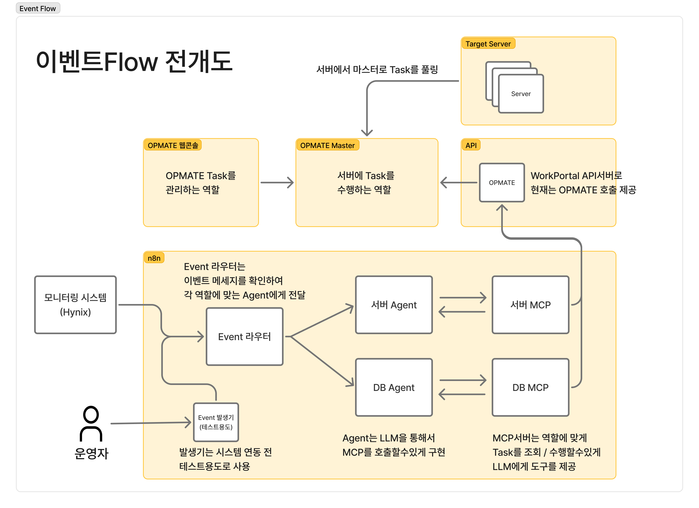
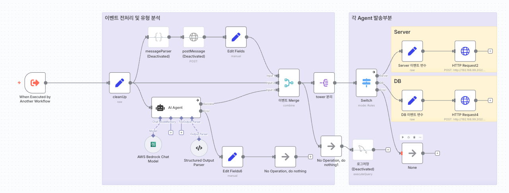
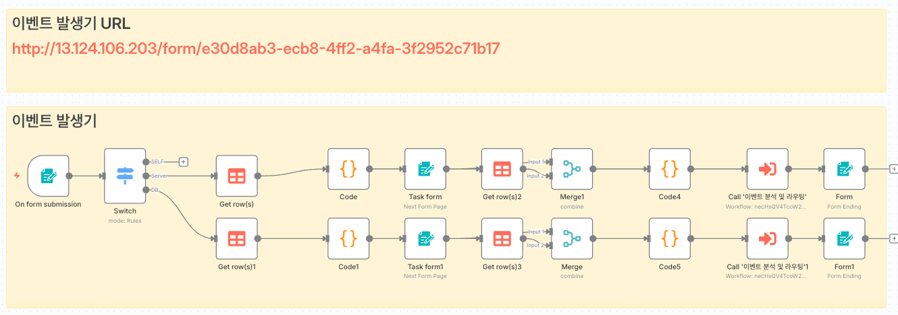
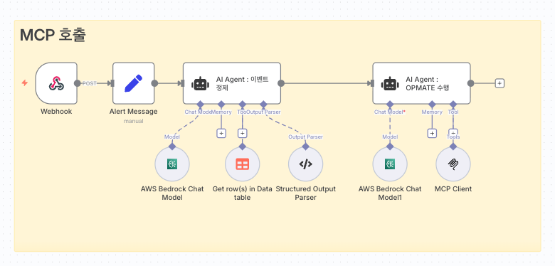
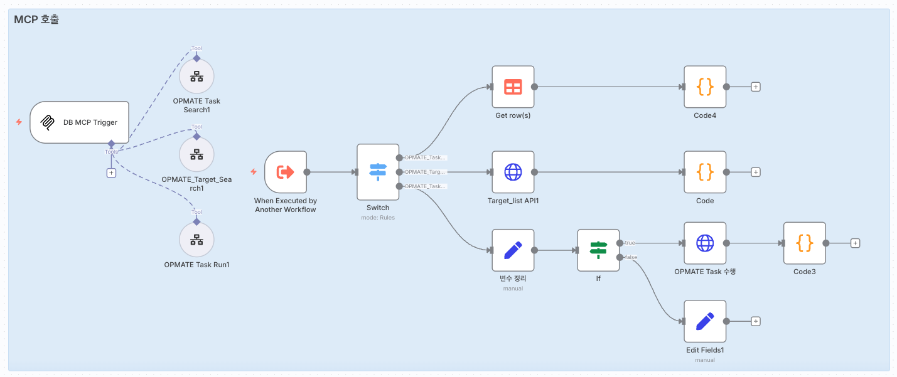

# 이벤트 Flow 가이드

## 목차

---

## 이벤트 Flow 개요

### 전체 아키텍처

- n8n에서 이벤트가 발생할 경우 이벤트 라우터를 통해서 이벤트가 어떤 Agent에서 수행될지 분석합니다.
- 모니터링 시스템 연동이 안되기 때문에 이벤트 발생기를 통해서 임시로 이벤트를 생성해서 고도화를 수행합니다.
- 수행해야할 Agent가 지정되면 해당 Flow에서 Agent가 opmate를 수행합니다.
- opmate 수행시 workportal api서버를 통해 인증하여 master에 Task 호출을 수행합니다.
- 각 서버들은 주기적으로 마스터를 풀링하여 Task가 지정될 경우 수행후 결과를 전달합니다.(약 15-30초 소요)
- Task 수행내역을 분석하여 현재 서버의 상태를 분석하여 사용자에게 제공합니다.
- 추후에 해당 내용을 메세지 서비스로 제공합니다.

---

## 각 노드 역할

### 이벤트 라우터
### flow명 : [System] Event Router

**역할:**
- 이벤트 발생시 이벤트를 분석하여 각 Agent에 분기

**수정 필요 부분:**
- AI Agent내 system prompt 및 output parser
- Server / DB Agent webhook url

### 이벤트 발생기
### flow명 : [System] Event Creator

**역할:**
- 시스템 내 테스트 이벤트 생성 및 발송
- 수행할 경우 url을 통해서 form에 접속하여 발송

**수정 필요 부분:**
- data tables(아래 표 참고)

- 이벤트 목록에 이벤트 추가 및 수정 필요
- 서버 정보에 수행하는 호스트목록 및 추가 기준정보 항목 필요(자산시스템 연동시 불필요)
- opmate task 목록 필요(이 부분은 수동 작성 필요)

---

### 서버 / DB Agent

### flow명 : [Agent] Server Agent
### flow명 : [Agent] DB Agent

**역할:**
- 역할 별 OPMATE 수행 및 추가 Flow 구현

**수정 필요 부분:**
- AI Agent : OPMATE 수행 내 system prompt
- MCP 연동 부분 endpoint url 수정 필요

---
### 서버 / DB MCP 

### flow명 : [Tool] MCP Server
### flow명 : [Tool] MCP DB

**역할:**
- 역할 별 도구 모음

**수정 필요 부분:**
